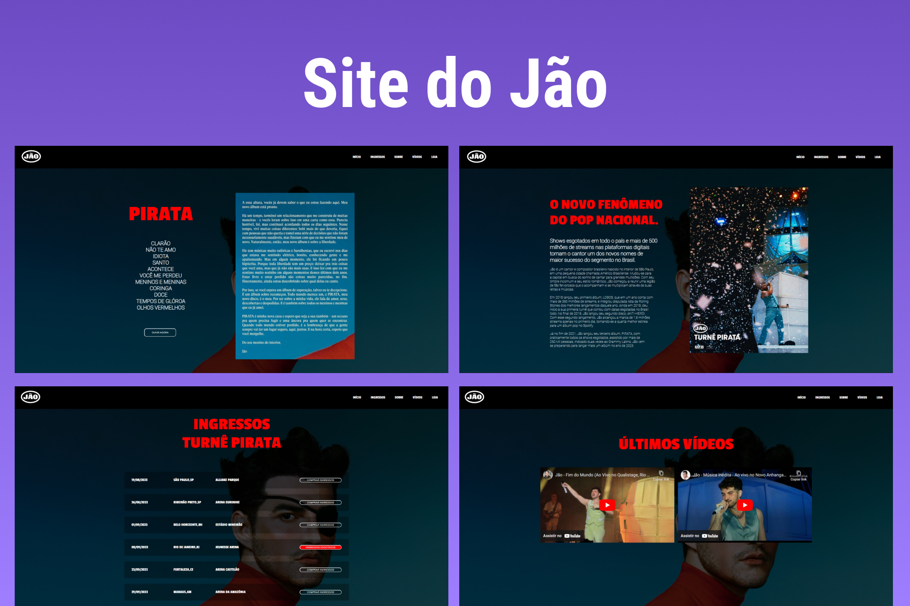

<h1 align="center"> SITE DO JÃO </h1>

A fim de aumentar meus conhecimentos, decidi propor um próprio desafio a mim mesmo que foi a criação desse site baseado no site oficial do cantor Jão.  

  <a href="#-tecnologias">Tecnologias</a>&nbsp;&nbsp;&nbsp;|&nbsp;&nbsp;&nbsp;
  <a href="#-projeto">Projeto</a>
  

  

 

  

## 🚀 Tecnologias

Esse projeto foi desenvolvido com as seguintes tecnologias:

- HTML e CSS
- Git e Github
- Figma

## 💻 Projeto

Me inspirei no site oficial do cantor paulista Jão, e com meus conhecimentos (e alguns novos que adquiri ao fazer o projeto) recriei de um jeito que me agrade mais.

- [Acesse o projeto finalizado, online.](https://kauatiezzi.github.io/jao-website)

---

Feito com ♥ by Kauã Tiezzi [Entre em contato comigo clicando aqui.](https://discord.gg/aaaa)